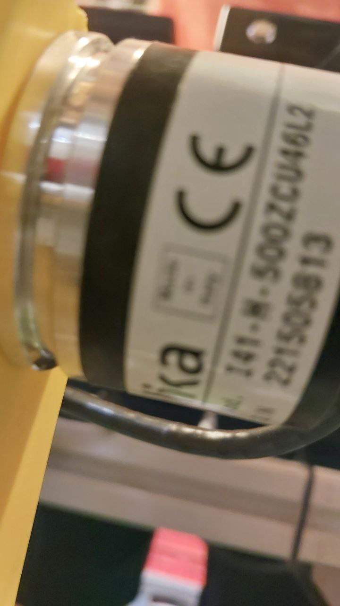
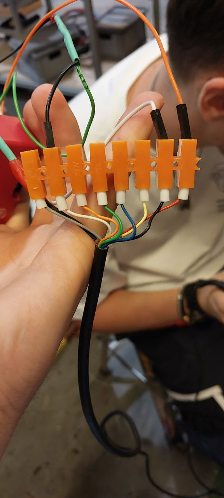
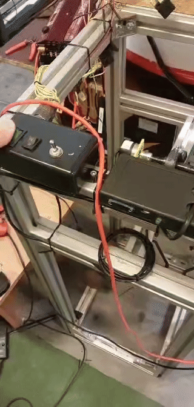

<h1>Engine data recorder.</h1>

This small project aimed to make an engine speed recorder (500 impulses per single rotation), that will record the rpm of the engine and the period of each rotation.

The rotation is being measured by the use of an encoder. It has:

<ul>
  <li>A - yellow wire</li>
  <li>~A - green wire</li>
  <li>B - blue wire</li>
  <li>~B - orange wire</li>
  <li>~B - orange wire</li>
  <li>single-rotaion - white wire</li>
  <li>~single-rotaion - gray wire</li>
  <li>VCC - 5V power line, red wire</li>
  <li>GND - ground line, black wire</li>
</ul>
. 

Single-rotation wire emits the high-level signal each time there is a full-rotation, which will be used.

Prototype connection for signal investigation:

<h2>The circuitry:</h2>

The recorder has inside:

<ul>
  <li>The power module, that takes the power from an external accumulator(16V) and converts it to 5V and 3.3V output.</li>
  <li>The Raspberry Pi Pico board with RP2040 microcontroller, programmed with MicroPython, used to collect, process and save the data</li>
  <li>SPI SSD card module - used to save the data, in bigger storage.</li>
</ul>

The encoder input is connected to raspberry with a 3.3V zenner diode so that the voltage of the signal will not exceed 3.3V. There are also 2 connectors for the encoder output (VCC, GND and a SIGNAL) and the battery input (16V VCC and GND).
The assembled circuitry looks like this:

And when mounted on a measuring stand:

<h2>Embedded Software</h2>

The script for the Raspberry Pi is called "<b>main.py</b>". It uses a hardware interrupt for each cycle of rotation, and then records the data inside a csv file. 

