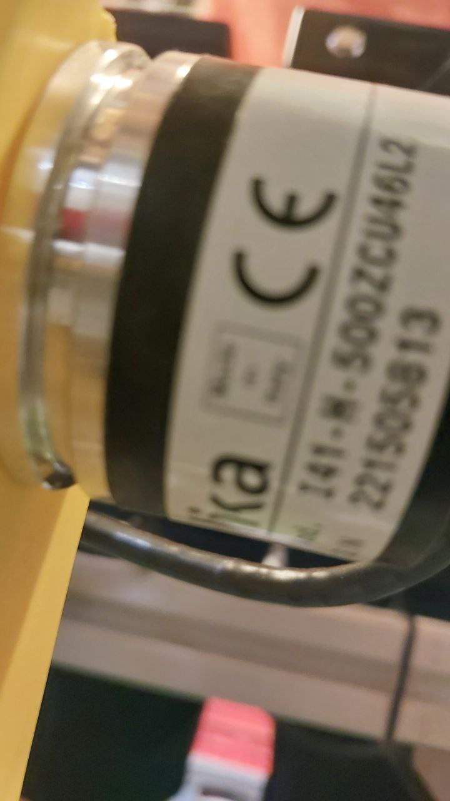
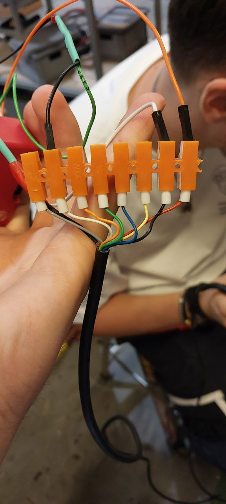
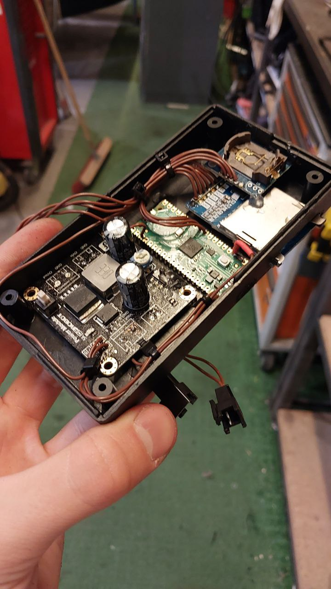

<h1>Engine data recorder.</h1>

This small project aimed to make an engine speed recorder (500 impulses per single rotation), that will record the rpm of the engine and the period of each rotation.

The rotation is being measured by the use of an encoder. It has:

<ul>
  <li>A - yellow wire</li>
  <li>~A - green wire</li>
  <li>B - blue wire</li>
  <li>~B - orange wire</li>
  <li>~B - orange wire</li>
  <li>single-rotaion - white wire</li>
  <li>~single-rotaion - gray wire</li>
  <li>VCC - 5V power line, red wire</li>
  <li>GND - ground line, black wire</li>
</ul>
. 

Single-rotation wire emits the high-level signal each time there is a full-rotation, which will be used.

Prototype connection for signal investigation:

<h2>The circuitry:</h2>

